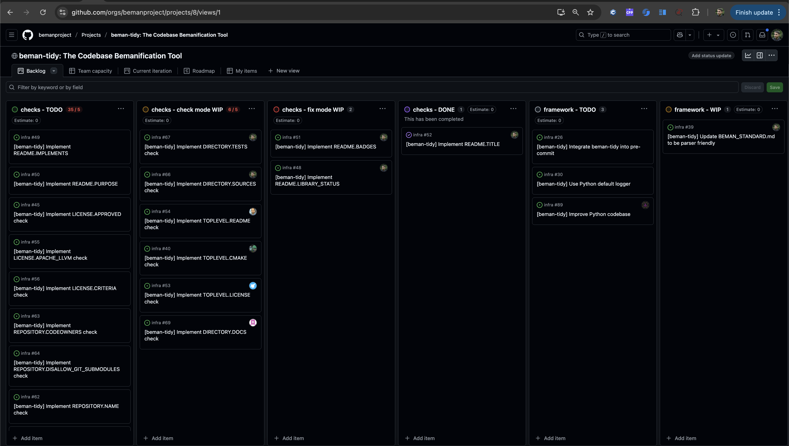

# Beman Sofia Hackathon

During the ISO WG21 C++ Meeting in [Sofia, June 2025](https://wg21.link/N5004), we hosted an in-person Beman - Evening Session — a mix of short presentations, a hands-on hackathon, and plenty of big ideas for the future of C++. What started as a relaxed gathering quickly turned into a productive (and caffeinated) brainstorming hub, where we explored potential C++29 library proposals, shared early-stage experiments, and even wrote code live. It was part workshop, part jam session, and fully in the spirit of what makes the C++ community so unique: collaboration, creativity, and a shared passion for pushing the language forward.

<!-- truncate -->

Since November 2024, we have been organizing Beman presentations at ISO WG21 C++ meetings (Warsaw 2024 - Poland, Hagenberg 2025 - Austria). Since we have been receiving positive feedback, we decided to organize another one in Sofia, June 2025 - Bulgaria.  (Note that our next session will be at CppCon in September in Colorado - stay tuned for more details!)

We had a great turnout, with 25 participants. The evening started with a great discussion about The Beman Project and where it is going, especially considering the C++26 is closed and the design cycle  for C++29 is starting.

We presented our first [Production ready. API may undergo changes.](https://github.com/bemanproject/beman/blob/main/docs/BEMAN_LIBRARY_MATURITY_MODEL.md#production-ready-api-may-undergo-changes) library, which is the [beman.optional](https://github.com/bemanproject/optional) library, hoping to get it into the C++26 standard and become [Production ready. Stable API.](https://github.com/bemanproject/beman/blob/main/docs/BEMAN_LIBRARY_MATURITY_MODEL.md#production-ready-stable-api). We counted a total of 10 [Under development and not yet ready for production use.](https://github.com/bemanproject/beman/blob/main/docs/BEMAN_LIBRARY_MATURITY_MODEL.md#production-ready-stable-api) Beman libraries.

We have continued the discussion around our set of guidelines for the Beman libraries, which are described in [The Beman Standard](https://github.com/bemanproject/beman/blob/main/docs/BEMAN_STANDARD.md). This strong set of rules is a great foundation for our libraries, and it helps the authors to create libraries that are easy to use, maintain, and extend by example, using our awesome [beman.exemplar](https://github.com/bemanproject/exemplar) template library.

The second part of the evening was a hackathon with our latest tool [beman-tidy: The Codebase Bemanification Tool](https://github.com/bemanproject/infra/tree/main/tools/beman-tidy). For more context, the `beman-tidy` helps you to apply the Beman Standard to your codebase, at a later stage in the library development.

Since the `beman-tidy` framework was already ready to use, but still required some work to implement around 40-50 checks, we created the [beman-tidy Project on GitHub](https://github.com/orgs/bemanproject/projects/8) to track the progress of the implementation and to split the work into smaller tasks.

The implication during the hackathon was substantial, with 10 participants working on the `beman-tidy` framework, and more pushing PRs at a later point in time. The tool is not completed yet, so feel free to contribute (ping [@neatudarius](https://github.com/neatudarius) on GitHub, which is the `beman-tidy` author).

We were very happy with the impact of that evening (Wednesday evening, in the middle of the ISO WG21 C++ Meeting), but surprises continued ...

After Friday's LEWG session,  [P3655R1: std::zstring_view](https://wg21.link/P3655R1) was presented and got feedback to continue the proposed direction. As an immediate consequence of this event, a new author created the [beman.cstring_view](https://github.com/bemanproject/cstring_view) library, to pursue the C++29 proposal.

The cherry on the cake was the Saturday's plenary! Lots and lots of great news for Beman folks!

The proposals behind the [beman.task](https://github.com/bemanproject/task), [beman.execution](https://github.com/bemanproject/execution) and [beman.net](https://github.com/bemanproject/net) libraries got accepted in C++26, although significant work remains to make them production ready.

Previously, in Saint Louis June 2024, [(P3168R2) Give std::optional Range Support](https://wg21.link/P3168R2) was accepted into the ISO C++ Working Draft, which is one of the two papers implemented in [beman.optional](https://github.com/bemanproject/optional). The missing piece was the [(P2988R12) `std::optional<T&>`](https://wg21.link/P2988R12) paper, which was **also** accepted into the ISO C++ Working Draft. That makes [beman.optional](https://github.com/bemanproject/optional) require just a little bit more work to get it [Production ready. Stable API.](https://github.com/bemanproject/beman/blob/main/docs/BEMAN_LIBRARY_MATURITY_MODEL.md#production-ready-stable-api).

We couldn't be happier with the outcome of this event, and we are looking forward to the next one! Please check out the [Beman Project](https://github.com/bemanproject) on GitHub or [join us on Discourse](https://discourse.bemanproject.org/latest) to get involved!
