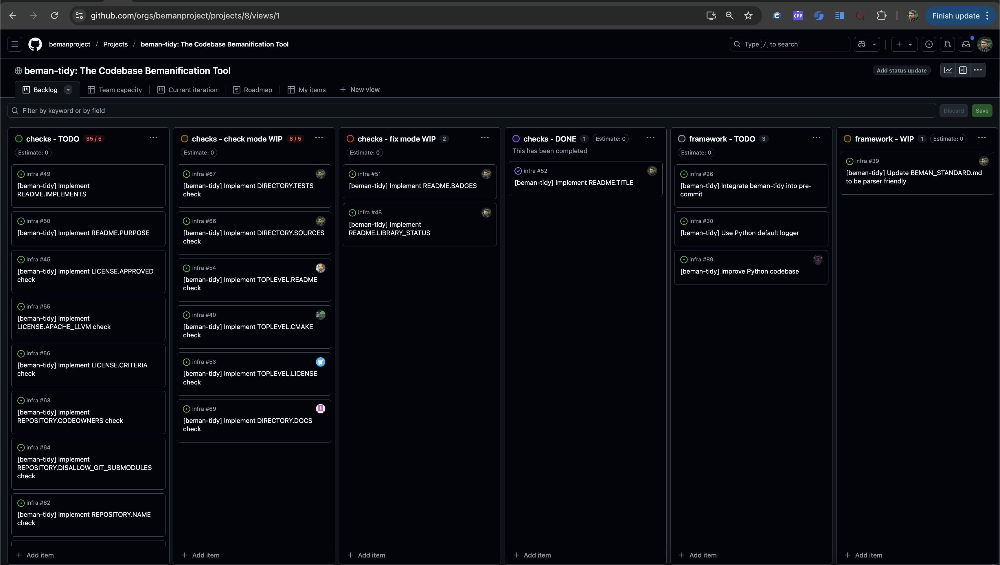

# Beman Sofia Hackathon

During the ISO C++ Meeting in [Sofia, June 2025](https://wg21.link/N5004), we hosted a lively Beman Evening session — a mix of short presentations, a hands-on hackathon, and plenty of big ideas for the future of C++. What started as a relaxed gathering quickly turned into a productive (and caffeinated) brainstorming hub, where we explored potential C++29 library proposals, shared early-stage experiments, and even wrote code live. It was part workshop, part jam session, and fully in the spirit of what makes the C++ community so unique: collaboration, creativity, and a shared passion for pushing the language forward.

<!-- truncate -->

Since November 2024, we have been organizing Beman presentations at ISO C++ meetings (Warsaw 2024 - Poland, Hagenberg 2025 - Austria). Since we have been receiving positive feedback, we decided to organize another one in Sofia, June 2025 - Bulgaria.

We had a great turnout, with 25 participants. We had a great discussion about The Beman Project and where it is going, considering the near-by new C++29 cycle that will start in early 2026. 

We presented our first [Production ready. API may undergo changes.](https://github.com/bemanproject/beman/blob/main/docs/BEMAN_LIBRARY_MATURITY_MODEL.md#production-ready-api-may-undergo-changes), which is the [beman.optional](https://github.com/bemanproject/optional) library, hoping to get it into the C++26 standard and become [Production ready. Stable API.](https://github.com/bemanproject/beman/blob/main/docs/BEMAN_LIBRARY_MATURITY_MODEL.md#production-ready-stable-api).

We counted a total of 10 [Under development and not yet ready for production use.](https://github.com/bemanproject/beman/blob/main/docs/BEMAN_LIBRARY_MATURITY_MODEL.md#production-ready-stable-api).

We have continued the discussion around our set of guidelines for the Beman libraries, which are described in [The Beman Standard](https://github.com/bemanproject/beman/blob/main/docs/BEMAN_STANDARD.md). This strong set of rules is a great foundation for the Beman libraries, and it helps library authors to create libraries that are easy to use, maintain, and extend, by, example, using our [beman.examplar](https://github.com/bemanproject/exemplar) template library.

Moving on, the second part of the evening was a hackathon with our latest tool [beman-tidy: The Codebase Bemanification Tool](https://github.com/bemanproject/infra/tree/main/tools/beman-tidy). 

For more context, the `beman-tidy` helps you to apply the Beman Standard to your codebase, at a later stage in the library development. 

Since the `beman-tidy` framework was ready, but still required some work to implemented around 40-50 checks, we created a the [beman-tidy Board](https://github.com/orgs/bemanproject/projects/8) to track the progress of the implementation and to split the work into smaller tasks.

The implication during the hackathon was substantial, with 10 participants working on the `beman-tidy` framework, and more pushing PRs at a later point in time. The tool is not completed yet, so feel free to contribute (ping @neatudarius on GitHub issues if you want to help).

We were very happy to the impact of that evening, but we had a surprinse after Friday's LEWG session, where [P3655R1: std::zstring_view](https://wg21.link/P3655R1) was presented and got feedback to continue the proposal directtion. As an immediate consequence of this event, a new author created [beman.cstring_view](https://github.com/bemanproject/cstring_view) library, to pursue the C++29 proposal. More over, proposals behind the [beman.task](https://github.com/bemanproject/task), [beman.execution](https://github.com/bemanproject/execution) and [beman.net](https://github.com/bemanproject/net) libraries got accepted in C++26 and we have more exciting work to do for making them production ready.
